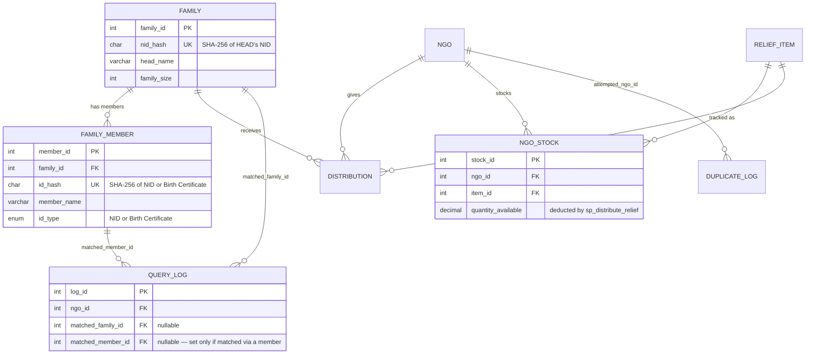
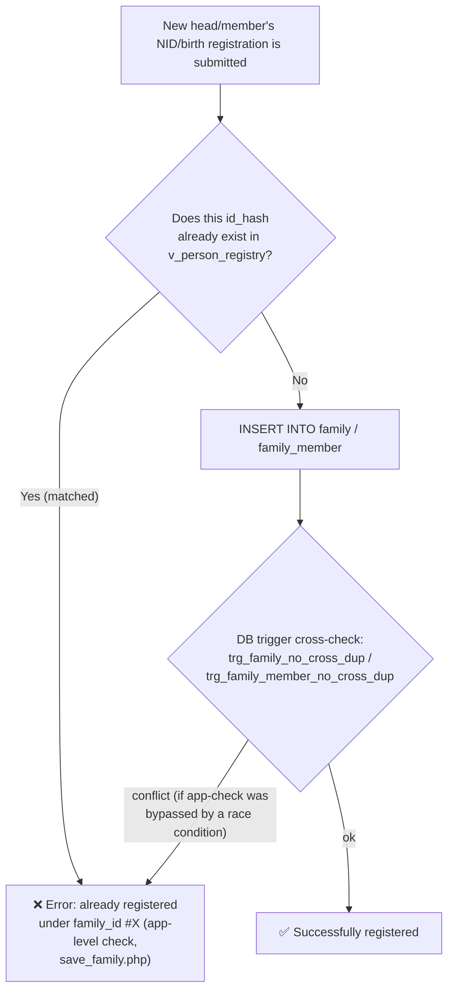
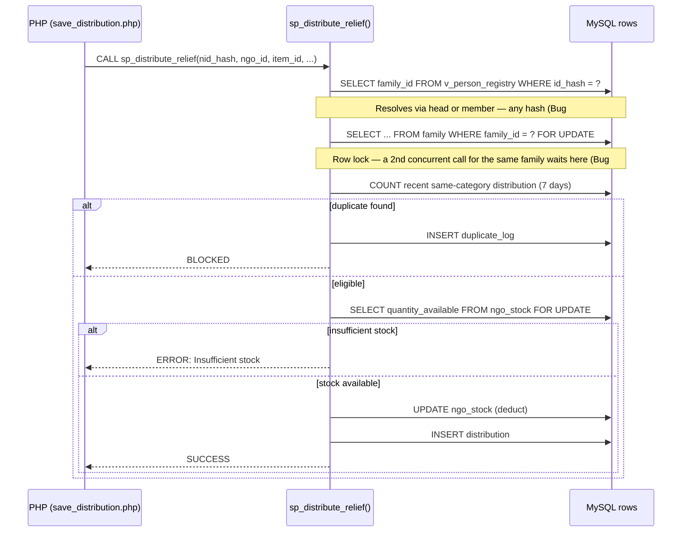

# Relief Distribution Duplicate Prevention System — Setup Guide

A full-stack project ready to run directly on XAMPP: **HTML + CSS + JavaScript + PHP + MySQL**.

## 0. Problem Definition, Stakeholders & USP (DBMS guideline — Component A)

**Problem:** Two real problems keep recurring in post-flood relief distribution in Bangladesh:
1. The same family receives the same type of relief multiple times from different NGOs, while the neighboring family gets nothing at all.
2. Sensitive information like NID is written in open registers, creating a privacy risk.

This system solves both problems at the database level (via trigger + procedure + constraint) — not just with frontend validation.

**Stakeholders / System Users:** District Relief Officer (admin), NGO operator (ngo_operator), affected families (end beneficiary — doesn't use the system directly, but is the subject of the data).

**Constraints / Complexity:** During a disaster, multiple NGOs enter data in parallel (concurrency race condition — see §7.1 Bug #2), NID cannot be stored in plain text (privacy), and spelling variations in Bengali names (e.g. "Rahim/Rahiim") can cause duplicate registrations (fuzzy matching is needed).

**USP (Unique Selling Point):**
1. NID is never stored in plain text — only a salted SHA-256 hash (`nid_hash`).
2. 7-day category-based duplicate blocking, enforced at two levels — trigger + stored procedure (defense-in-depth).
3. Custom Unicode-aware fuzzy matching for Bengali names (`mb_levenshtein()`, because PHP's built-in `levenshtein()` and MySQL's `SOUNDEX()` don't work for Bengali).
4. Population-proportional fairness dashboard, based on the `v_area_fairness` VIEW.

## 1. Setup (5 steps)

1. Copy the entire `relief_system` folder into XAMPP's `htdocs` folder
   (path will look like: `C:\xampp\htdocs\relief_system\` or `/Applications/XAMPP/htdocs/relief_system/`)
2. From the XAMPP Control Panel, start both **Apache** and **MySQL**
3. Open `http://localhost/phpmyadmin` in your browser → **Import** tab → select the `database.sql` file → click **Go**
   (this creates the `relief_db` database and inserts all tables + triggers + procedures + views + 20+ families and 28 distribution records)
4. Go to `http://localhost/relief_system/install.php` in your browser — this creates the login accounts (run this only once)
5. **Delete install.php** (for security — an install script should never be left open), then open `http://localhost/relief_system/`

> **Optional (Version 2.0+):** DB credentials and the NID hashing salt are no longer hardcoded — they're now read from an `.env` file (see §7.2).
> The repo includes `.env.example` as a template — copy it to `.env` and edit as needed. If `.env` doesn't exist, the system
> falls back to the previous hardcoded defaults, so skipping this step won't break the setup.

## 2. Login credentials

| Username | Password | Role |
|---|---|---|
| `admin` | `Admin@123` | District Relief Officer (can see everything) |
| `asha_operator` | `Ngo@123` | Operator for Asha Foundation |
| `relief_operator` | `Ngo@123` | Operator for Relief Bangladesh |
| `sfv_operator` | `Ngo@123` | Operator for Save the Flood Victims |

## 3. File Structure

```
relief_system/
├── database.sql              ← schema + triggers + procedure + views + seed data (import this first)
├── config.php                ← DB connection + hashNID() + mb_levenshtein() + .env loader
├── .env                       ← real secrets (gitignored — create it on your own machine, or defaults will be used)
├── .env.example                ← template for .env, this one is committed
├── .gitignore                   ← excludes .env from version control
├── .htaccess                      ← blocks direct browser access to dotfiles (.env etc.)
├── install.php                ← run once to create accounts, then delete
├── index.php                  ← Login page
├── logout.php
├── distribute.php             ← main page: NID → live duplicate check → calls sp_distribute_relief()
├── register_family.php        ← family registration + fuzzy name matching + identity conflict check
├── dashboard.php               ← Admin-only: fairness gauge + NGO performance + weekly trend chart
├── duplicate_log.php           ← Admin-only: blocked attempt history + lookup audit trail
├── stock.php                    ← Admin-only: view NGO-wise stock and restock
├── includes/
│   ├── auth.php                ← requireLogin() / requireRole() / csrfToken() / requireCsrf()
│   ├── env.php                  ← small .env parser (no composer dependency)
│   ├── header.php               ← role-aware nav bar + CSRF_TOKEN JS constant
│   └── footer.php
├── api/                          ← AJAX endpoints (called via fetch() from the browser, all CSRF-protected)
│   ├── check_duplicate.php       ← read-only lookup — resolves by head or member, any NID/BRC
│   ├── fuzzy_check.php
│   ├── save_family.php           ← does identity-conflict check before insert
│   ├── save_distribution.php     ← the only place from which distributions are inserted
│   ├── save_distribution_point.php
│   └── save_stock.php             ← admin-only: adds quantity to ngo_stock
├── css/style.css
└── js/app.js
```

## 4. What to Demonstrate in the Viva

1. **Duplicate blocking:** Log in as `asha_operator` → on distribute.php, enter NID `1985011234501`
   (Rahim Uddin, received rice 15 days ago — outside the 7-day window, so should show as eligible now) → submit with item "Blanket" (a different category)
   → should succeed. Now submit again with the same NID + same item → 🚫 blocked, and
   an entry will appear in `duplicate_log.php` (when logged in as admin).
   (NID pattern for the 20 demo families: family #N ↔ `19850112345` + N in two digits, e.g. family #10 ↔
   `1985011234510` — any of them can be used for testing, see §7.1 Bug #6.)
2. **Fuzzy matching:** On register_family.php, try registering a name close to "Rahim Uddin" like "Rahiim Uddeen"
   → a warning modal will appear.
3. **Role-based access:** Logging in as `admin` shows the Dashboard + Duplicate Log tabs and lets you browse
   the full family list; logging in as `asha_operator` hides these and locks the NGO field on distribute.php.
4. **Fairness dashboard:** Open dashboard.php as `admin` — a gauge bar shows which area received less relative
   to its population, along with NGO Performance and Weekly Trend bar charts.
5. **Identity conflict (Version 2.0 — new):** On register_family.php, try registering a new family with an NID
   that's already registered as a member of another family (in family_member) → it immediately shows an error
   "This NID is already registered under family_id #X", and the insert is blocked. This is the core bug that was fixed —
   details in §7.
6. **Distributing relief using a member's NID (Version 2.0 — new):** On distribute.php, instead of the
   family head's NID, enter a family_member's NID/birth registration number → the family is still found correctly,
   and a note appears: "ℹ️ This NID does not belong to the family head...". Previously this showed "not_found".
7. **Stock enforcement (Version 2.0 — new):** As admin, go to `stock.php` and reduce the quantity_available
   for some NGO-Item (or leave a small quantity and try to distribute more) → distribute.php shows
   "ERROR: Insufficient stock for this NGO/item" when that amount is requested, and the distribution is not inserted.
8. **CSRF protection (Version 2.0 — new):** Try changing the `CSRF_TOKEN` variable from browser DevTools and
   calling any api/*.php endpoint → you'll get a 403 with a "session expired" message, and nothing gets inserted.

## 5. Mapping to Guideline Components

| Guideline component | Where it is |
|---|---|
| Problem statement / stakeholders / USP | §0 of this file |
| ER diagram / 3NF | `er_diagram.png` (see §0.1 for how it was built) + table design in `database.sql`, mermaid ER in §7.3 |
| CREATE TABLE + constraints | `database.sql` — all PK/FK/CHECK/UNIQUE present |
| ≥20 records/table | family: 20, distribution: 28, district: 64, upazila: ~487 |
| INSERT/UPDATE/DELETE/SELECT (WHERE/GROUP BY/ORDER BY/LIMIT/HAVING)/JOIN/Aggregate (COUNT/SUM/AVG)/Subquery | used throughout the app (see the api files) + individually runnable examples in `queries_for_report.sql` |
| TRIGGER | `trg_block_duplicate`, `trg_family_no_cross_dup`, `trg_family_member_no_cross_dup` (Version 2.0) |
| PROCEDURE | `sp_distribute_relief` (Version 2.0 added transaction + row lock + stock deduction) |
| VIEW | `v_area_fairness`, `v_person_registry` (Version 2.0 — identity resolution) |
| Transaction | `START TRANSACTION`/`COMMIT`/`ROLLBACK` in `sp_distribute_relief` + PDO transactions in `api/save_family.php`, `register_ngo.php` |
| System roles/privileges (optional) | session-based role check (`includes/auth.php`) + each NGO operator restricted to their own ngo_id + CSRF token (Version 2.0); example DB-level `GRANT` statements in `roles_optional.sql` (optional, not run) |
| Investigation & Analysis (Component D) | questions D1–D3 in `queries_for_report.sql` (underserved area, category demand, severity-wise fairness) |

## 6. Key Engineering Decisions (worth writing up in the report)

- **PHP's built-in `levenshtein()` gives incorrect results on Bengali text** (it's byte-based, but Bengali characters are multi-byte UTF-8).
  So a custom `mb_levenshtein()` was written in `config.php` that compares Unicode characters instead.
- **MySQL's `SOUNDEX()` is designed for English phonetics** and doesn't give meaningful codes for Bengali names — so fuzzy matching uses
  a LIKE-based candidate filter (matching the first 2 characters) + confirmation via `mb_levenshtein()` in PHP — this is a
  good example of EP2 (performance vs. correctness trade-off, a conflicting requirement for non-Latin scripts).
- **Defense-in-depth:** the submit button is deliberately not disabled after a duplicate warning is shown — because real
  enforcement shouldn't live in client-side JS, it should live in the database's trigger and procedure. Even if the client is
  bypassed, the database will still block it.

## 7. Version 2.0 — Bug Fixes & New Features (detailed log)

This section is kept so that **we can remember for ourselves in the future why a bug happened and how it was fixed.**
Each fix has a `BUG FIX (README "Bug #X")` comment in the relevant file, so you can come back to this log while reading the code.

### 7.1 Bugs Found & Fixed

**Bug #1 — the same person could register twice (the core problem that started this whole update)**
- **Problem:** The `family` table only stores the family head's NID (`nid_hash`), while the `family_member` table stores
  the other members' NID/birth registration (`id_hash`). During registration (`api/save_family.php`), a new head's NID was
  checked only against the `family` table — not against `family_member`. As a result, someone already registered as a member
  of another family could register again as a separate family head — creating two separate relief entitlements for the same
  person. During relief distribution too (`api/check_duplicate.php`, `sp_distribute_relief`), the family was looked up only
  by the head's NID — entering a member's NID/birth registration number would show "not_found", even though that person was
  actually part of a registered family.
- **Fix:**
  1. New VIEW `v_person_registry` — unions family (head) and family_member (members) into one place,
     telling you which `family_id` an `id_hash` belongs to, and whether it's the head or a member.
  2. Two new triggers — `trg_family_no_cross_dup` (checks before inserting as head whether the NID already exists
     as a member) and `trg_family_member_no_cross_dup` (the reverse) — a hard safety net at the DB level.
  3. `api/save_family.php` now shows a friendly app-level error (including which family_id it's already under),
     so the operator understands before it even reaches the trigger. **Deliberately, no "force/override" option
     was added here** — because an identity conflict always means either a genuine duplicate or a data-entry mistake;
     the correct fix for both is to correct the earlier record, not create a new parallel identity.
  4. `api/check_duplicate.php` and `sp_distribute_relief` now resolve via `v_person_registry` — entering the head's
     or any member's NID/birth registration number correctly finds the family, and the 7-day duplicate-check
     applies to that family.
- **Test:** See README §4 items 5 and 6.

**Bug #2 — Race condition: two parallel requests could let the same family receive relief twice**
- **Problem:** In the old `sp_distribute_relief`, "SELECT COUNT(*) recent" and "INSERT INTO distribution" were two
  separate auto-committed statements with no row lock in between. If two operators submitted for the same family at
  nearly the same moment, both calls could see recent_count = 0 (because each other's INSERT wasn't committed/visible
  yet), so both would pass the duplicate-check and the family would end up receiving relief twice.
- **Fix:** The whole procedure is now wrapped in an explicit `START TRANSACTION`, and before the duplicate-check,
  `SELECT ... FROM family WHERE family_id=? FOR UPDATE` locks that family's row — so a second concurrent call for the
  same family is blocked here until the first one's COMMIT/ROLLBACK completes. The same logic applies to `ngo_stock`
  (see below), so that two parallel distributions can't push stock below zero together.
- **Test (hard to demonstrate manually, show in code review):** Show the
  `START TRANSACTION` ... `FOR UPDATE` ... `COMMIT`/`ROLLBACK` pattern inside `sp_distribute_relief` in `database.sql`.

**Bug #3 — DB password and NID salt were hardcoded directly in the code**
- **Problem:** `DB_PASS`, `NID_SALT`, etc. were written as literal strings in `config.php` — once committed to
  version control, they'd remain in history forever.
- **Fix:** `includes/env.php` (a small `.env` parser, no composer) + `.env` (the real secrets, gitignored) +
  `.env.example` (a committed template) + `.htaccess` (blocks direct browser access to dotfiles). If `.env` is
  missing, it falls back to the previous hardcoded defaults, so existing setups don't break.

**Bug #4 — the demo accounts created by `install.php` could never log in**
- **Problem:** The schema default for the `users.is_verified` column is `0`. `install.php` didn't explicitly
  set `is_verified` when creating accounts, so on a completely fresh install neither admin nor any operator could
  log in (`index.php` showed a "please verify your email first" error, even though no verification email is ever
  sent for these accounts). This bug was caught during live testing for this update.
- **Fix:** The INSERT in `install.php` now explicitly sets `is_verified = 1` — because these accounts are created
  by a trusted installer, not through `register_ngo.php`'s public self-registration flow, so email verification
  doesn't apply.

**Bug #6 — none of the 20 demo families could ever be found by NID (the most important discovery)**
- **Problem:** Caught during live testing for this update — calling `check_duplicate.php` with the documented demo
  NID from README §4 (`1985011234501`) returned "not_found", even though family_id 1 definitely exists in the
  database. The cause was traced: every `nid_hash` seeded for the 20 families in `database.sql` was actually
  **62–63 characters long, not 64** (confirmed in the DB using `CHAR_LENGTH()`) — whereas a SHA-256 hash is always
  exactly 64 hex characters. For family 1, it turned out the very last character of the correct hash was missing
  (likely a copy-paste error while pre-computing the hashes). This meant **this flagship duplicate-blocking demo
  had never worked from day one** — not a single one of the 20 could be matched with its actual NID.
- **Fix:** The correct SHA-256(NID + salt) was recomputed for the sequential demo NIDs `1985011234501` through
  `1985011234520`, and all 20 families' `nid_hash` values were replaced. Family 1's demo NID was kept unchanged
  (it was already documented in the README), and the remaining 19 were assigned new NIDs following the same
  pattern (sequential, like `phone`) — now **for any family_id, the NID can be built from the last 2 digits of
  `phone`**: family #N ↔ NID `19850112345` + N (2 digits, e.g. family #7 ↔ `1985011234507`).
- **Test:** Entering any `19850112345XX` (XX = 01–20) as the NID on distribute.php will now find the matching
  family — previously this wasn't possible at all.

**Bug #5 — expired sessions caused a 404 loop when calling `api/*.php`**
- **Problem:** `requireLogin()` sent `header('Location: index.php')` when not logged in — a *relative* path.
  This worked fine when called from a page controller (like `distribute.php`), but when called from a file like
  `api/save_family.php`, the browser resolved it as `/relief_system/api/index.php` — which doesn't exist, hence
  404. Also, sending an HTML redirect for an AJAX/fetch() call is the wrong approach in general — the frontend
  expects JSON.
- **Fix:** A new `isApiRequest()` helper in `includes/auth.php` — checks whether `/api/` appears in `SCRIPT_NAME`.
  If so, `requireLogin()`/`requireRole()` now return a clean JSON 401/403 response (with an `api_session_expired`
  key), instead of a plain HTML redirect.

### 7.2 New Features (not bugs, new additions)

- **CSRF protection** — `csrfToken()`/`requireCsrf()` in `includes/auth.php`, a session-based token. All
  state-changing APIs (`save_family`, `save_distribution`, `save_distribution_point`, `save_stock`) and the
  `register_ngo.php` form now verify the token, or return 403. Previously no form had CSRF protection.
- **NGO Stock tracking** — new table `ngo_stock` (ngo_id, item_id, quantity_available). `sp_distribute_relief`
  now deducts from stock on every successful distribution and blocks the distribution if stock is insufficient
  (previously there was no concept of stock at all — an NGO could theoretically give out an infinite quantity).
  A new `stock.php` page (admin-only) shows the current stock for every NGO-Item and lets you add to it via
  `api/save_stock.php`.
- **Dashboard charts** — `dashboard.php` now shows NGO Performance and an 8-week Weekly Trend bar chart next
  to the fairness gauge (with no external JS chart library — just CSS, so it also works in an offline viva).
- **Richer audit trail** — new columns `matched_family_id`, `matched_member_id` in the `query_log` table —
  recording which family/member each lookup matched. `duplicate_log.php` now has a new "🔍 Lookup Audit Trail"
  section showing this to the admin (previously only blocked attempts were visible, not successful lookups).

### 7.3 ER Diagram — identity- and stock-related tables



> **Note:** `v_person_registry` is a VIEW (a UNION of family + family_member), so it doesn't appear as a
> separate entity in this ER diagram — the flowchart below shows how it's used.

### 7.4 Identity Resolution Flow — during registration



### 7.5 During Relief Distribution — resolution + race-condition fix + stock check



### 7.6 Frontend Polish — logo, animations, map

- **Logo:** Two variants were made from `Logo.jpeg` — `img/logo-full.jpeg` (full, with wordmark, used on login/registration pages) and `img/logo-icon.png` (just the circular emblem, wordmark cropped out, used for the header badge + favicon).
- **CSS animations:** card/KPI fade-up entrance; gauge/bar fills now animate from 0 to their target value (`animateFillBars()` in `js/app.js`); KPI numbers count up (`animateKpiCounters()`); button hover/active states get lift+scale feedback; a floating gradient blob background on the login page.
- **🗺️ Relief Zone Map (dashboard.php):** Leaflet.js + OpenStreetMap (no API key needed) shows the 8 relief zones on a map of Bangladesh — marker color reflects the fairness ratio (red/yellow/green), marker size reflects population. Each area's lat/lng is hardcoded as a PHP array in `dashboard.php` (no new DB column was added, since these 8 areas are fixed reference data).
- **Accent color:** The logo's orange color (`--accent`) was added as the new brand accent (used for the active tab underline, `.btn-accent`, etc.).
- **Code-based email verification:** `register_ngo.php` used to send a verification link (which had to be clicked); it now sends a 6-digit code instead (via `includes/mailer.php`), and `verify_email.php` requires entering email+code to verify — direct code entry instead of a phishing-prone link-click flow.
