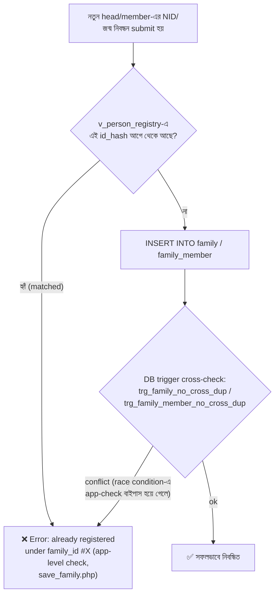
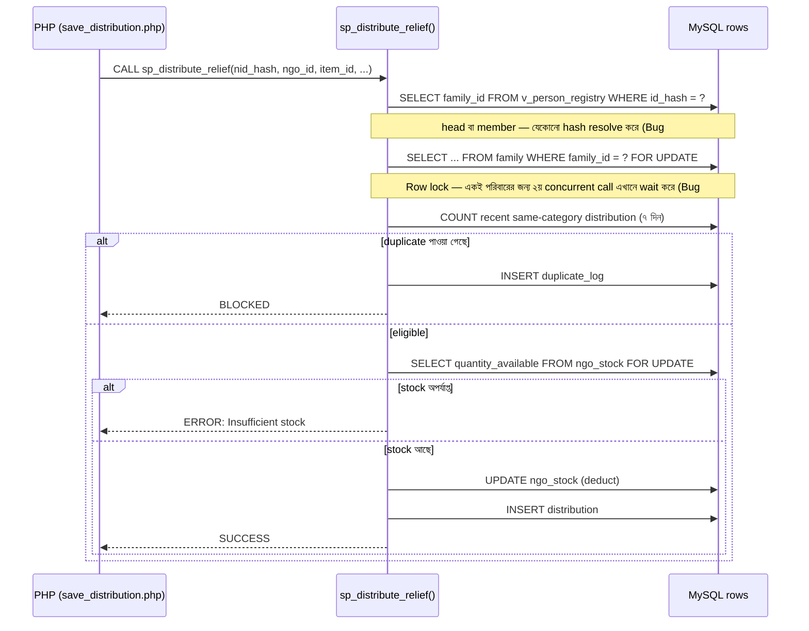

# ত্রাণ বিতরণ Duplicate Prevention System — Setup Guide

সরাসরি XAMPP-এ চালানোর জন্য প্রস্তুত একটা full-stack প্রজেক্ট: **HTML + CSS + JavaScript + PHP + MySQL**।

## ০. Problem Definition, Stakeholders ও USP (DBMS guideline — Component A)

**সমস্যা:** বন্যা-পরবর্তী ত্রাণ বিতরণে বাংলাদেশে দুটি বাস্তব সমস্যা বারবার দেখা যায়:
1. একই পরিবার একাধিক NGO থেকে একই ধরনের ত্রাণ একাধিকবার পেয়ে যায়, অথচ পাশের পরিবার কিছুই পায় না।
2. NID-এর মতো সংবেদনশীল তথ্য খোলা রেজিস্টারে লেখা হয়, যা privacy ঝুঁকি তৈরি করে।

এই সিস্টেম দুটি সমস্যাই ডাটাবেস-স্তরে (trigger + procedure + constraint দিয়ে) সমাধান করে — শুধু frontend validation দিয়ে না।

**Stakeholders / System Users:** জেলা ত্রাণ কর্মকর্তা (admin), NGO অপারেটর (ngo_operator), ক্ষতিগ্রস্ত পরিবার (end beneficiary — সরাসরি সিস্টেম ব্যবহার করে না, কিন্তু ডেটার subject)।

**Constraints / Complexity:** দুর্যোগের সময় একাধিক NGO সমান্তরালে entry দেয় (concurrency race condition — §৭.১ Bug #2 দেখুন), NID plain-text-এ রাখা যাবে না (privacy), বাংলা নামের বানানভেদ (যেমন "রহিম/রহীম") duplicate registration ঘটাতে পারে (fuzzy matching দরকার)।

**USP (Unique Selling Point):**
1. NID কখনো plain-text-এ সংরক্ষিত হয় না — শুধু salted SHA-256 hash (`nid_hash`)।
2. ৭ দিনের category-ভিত্তিক duplicate blocking, যা trigger + stored procedure — দুই স্তরে enforce হয় (defense-in-depth)।
3. বাংলা নামের জন্য custom Unicode-aware fuzzy matching (`mb_levenshtein()`, কারণ PHP-র built-in `levenshtein()` ও MySQL-এর `SOUNDEX()` বাংলায় কাজ করে না)।
4. জনসংখ্যা-অনুপাতিক fairness dashboard, `v_area_fairness` VIEW-ভিত্তিক।

## ১. Setup (৫ ধাপ)

1. পুরো `relief_system` ফোল্ডারটা কপি করে XAMPP-এর `htdocs` ফোল্ডারে রাখুন
   (path যেমন হবে: `C:\xampp\htdocs\relief_system\` বা `/Applications/XAMPP/htdocs/relief_system/`)
2. XAMPP Control Panel থেকে **Apache** ও **MySQL** দুটোই Start করুন
3. ব্রাউজারে `http://localhost/phpmyadmin` খুলুন → **Import** ট্যাব → `database.sql` ফাইলটা সিলেক্ট করে **Go** চাপুন
   (এটা `relief_db` ডাটাবেস বানাবে, সব টেবিল + trigger + procedure + view + ২০+ পরিবার আর ২৮টা distribution record বসিয়ে দেবে)
4. ব্রাউজারে যান: `http://localhost/relief_system/install.php` — এটা login account গুলো বানাবে (একবারই চালাবেন)
5. **install.php ডিলিট করে দিন** (নিরাপত্তার জন্য — install script সবসময় খোলা রাখা ঠিক না), তারপর `http://localhost/relief_system/` খুলুন

> **ঐচ্ছিক (Version 2.0+):** DB credentials আর NID hashing salt এখন হার্ডকোড না করে `.env` ফাইল থেকে পড়া হয় (দেখুন §৭.২)।
> রিপোতে `.env.example` আছে টেমপ্লেট হিসেবে — কপি করে `.env` বানিয়ে দরকারমতো বদলান। `.env` না থাকলেও আগের
> hardcoded default দিয়ে চলবে, তাই এই ধাপটা স্কিপ করলেও সেটআপ ভাঙবে না।

## ২. Login credentials

| Username | Password | Role |
|---|---|---|
| `admin` | `Admin@123` | District Relief Officer (সব দেখতে পাবে) |
| `asha_operator` | `Ngo@123` | আশা ফাউন্ডেশন-এর অপারেটর |
| `relief_operator` | `Ngo@123` | রিলিফ বাংলাদেশ-এর অপারেটর |
| `sfv_operator` | `Ngo@123` | সেভ দ্য ফ্লাড ভিকটিমস-এর অপারেটর |

## ৩. ফাইল স্ট্রাকচার

```
relief_system/
├── database.sql              ← schema + triggers + procedure + views + seed data (import করুন প্রথমে)
├── config.php                ← DB connection + hashNID() + mb_levenshtein() + .env loader
├── .env                       ← real secrets (gitignored — নিজের মেশিনে বানাতে হবে, বা default দিয়ে চলবে)
├── .env.example                ← .env-এর টেমপ্লেট, এটা কমিট হয়
├── .gitignore                   ← .env বাদ দেয় version control থেকে
├── .htaccess                      ← dotfile (.env ইত্যাদি) সরাসরি ব্রাউজার থেকে ব্লক করে
├── install.php                ← একবার চালিয়ে account বানান, তারপর ডিলিট
├── index.php                  ← Login page
├── logout.php
├── distribute.php             ← মূল পেজ: NID → live duplicate check → sp_distribute_relief() কল
├── register_family.php        ← পরিবার নিবন্ধন + fuzzy name matching + identity conflict check
├── dashboard.php               ← Admin-only: fairness gauge + NGO performance + weekly trend chart
├── duplicate_log.php           ← Admin-only: blocked attempt history + lookup audit trail
├── stock.php                    ← Admin-only: NGO-wise stock দেখা ও restock করা
├── includes/
│   ├── auth.php                ← requireLogin() / requireRole() / csrfToken() / requireCsrf()
│   ├── env.php                  ← ছোট .env parser (কোনো composer dependency ছাড়াই)
│   ├── header.php               ← role-aware nav bar + CSRF_TOKEN JS constant
│   └── footer.php
├── api/                          ← AJAX endpoints (browser থেকে fetch() দিয়ে কল হয়, সবগুলো CSRF-protected)
│   ├── check_duplicate.php       ← read-only lookup — head বা member, যেকোনো NID/BRC দিয়ে resolve করে
│   ├── fuzzy_check.php
│   ├── save_family.php           ← identity-conflict check করে তারপর insert করে
│   ├── save_distribution.php     ← একমাত্র জায়গা যেখান থেকে distribution insert হয়
│   ├── save_distribution_point.php
│   └── save_stock.php             ← admin-only: ngo_stock-এ পরিমাণ যোগ করে
├── css/style.css
└── js/app.js
```

## ৪. যা যা টেস্ট করে viva-তে দেখাবেন

1. **Duplicate blocking:** `asha_operator` দিয়ে লগইন করুন → distribute.php-তে NID `1985011234501` দিন
   (রহিম উদ্দিন, চাল পেয়েছিল ১৫ দিন আগে — ৭ দিনের বাইরে, তাই এখন eligible দেখাবে) → item "কম্বল" (অন্য category)
   দিয়ে submit করুন → success হবে। এবার আবার একই NID + একই item দিয়ে submit করুন → 🚫 blocked, আর
   `duplicate_log.php`-এ (admin login দিয়ে) entry দেখা যাবে।
   (২০টা ডেমো পরিবারের NID প্যাটার্ন: family #N ↔ `19850112345` + N দুই সংখ্যায়, যেমন family #10 ↔
   `1985011234510` — যেকোনোটা দিয়ে টেস্ট করা যাবে, দেখুন §৭.১ Bug #6।)
2. **Fuzzy matching:** register_family.php-তে "রহিম উদ্দিন" এর কাছাকাছি বানান "রহীম উদ্দীন" দিয়ে নিবন্ধন করার
   চেষ্টা করুন → warning modal আসবে।
3. **Role-based access:** `admin` দিয়ে লগইন করলে Dashboard + Duplicate Log ট্যাব দেখা যাবে এবং পুরো family list
   ব্রাউজ করা যাবে; `asha_operator` দিয়ে লগইন করলে এগুলো hidden থাকবে এবং distribute.php-তে NGO field lock করা।
4. **Fairness dashboard:** `admin` দিয়ে dashboard.php খুলুন — কোন এলাকা জনসংখ্যা-অনুপাতে কম পেয়েছে তা গেজ বার দিয়ে দেখাবে,
   সাথে NGO Performance আর Weekly Trend বার-চার্টও দেখা যাবে।
5. **Identity conflict (Version 2.0 — নতুন):** register_family.php-তে এমন একটা NID দিয়ে নতুন পরিবার নিবন্ধনের
   চেষ্টা করুন যেটা ইতিমধ্যে অন্য কোনো পরিবারের সদস্য হিসেবে (family_member-এ) নিবন্ধিত আছে → সাথে সাথে error
   দেখাবে "এই NID ইতিমধ্যে ... family_id #X-এ নিবন্ধিত আছে", insert হবে না। এটাই মূল বাগ যেটা fix করা হয়েছে —
   বিস্তারিত §৭-এ।
6. **সদস্যের NID দিয়ে ত্রাণ বিতরণ (Version 2.0 — নতুন):** distribute.php-তে family head-এর বদলে কোনো
   family_member-এর NID/জন্ম নিবন্ধন নম্বর দিন → পরিবার তবুও ঠিকমতো খুঁজে পাবে এবং "ℹ️ এই NID পরিবার প্রধানের নয়..."
   নোট দেখাবে। আগে এটা "not_found" দেখাতো।
7. **Stock enforcement (Version 2.0 — নতুন):** admin দিয়ে `stock.php`-এ গিয়ে কোনো NGO-Item-এর quantity_available
   কমিয়ে ফেলুন (বা ছোট quantity রেখে বেশি বিতরণ করার চেষ্টা করুন) → distribute.php থেকে সেই পরিমাণ চাইলে
   "ERROR: Insufficient stock for this NGO/item" দেখাবে, distribution insert হবে না।
8. **CSRF protection (Version 2.0 — নতুন):** browser DevTools থেকে `CSRF_TOKEN` ভ্যারিয়েবলটা বদলে দিয়ে
   কোনো api/*.php কল করার চেষ্টা করুন → 403 আর "সেশনের মেয়াদ শেষ" মেসেজ পাবেন, কিছুই insert হবে না।

## ৫. Guideline component-এর সাথে মিল

| Guideline component | কোথায় আছে |
|---|---|
| Problem statement / stakeholders / USP | এই ফাইলের §০ |
| ER diagram / 3NF | `er_diagram.png` (§০.১ দেখুন কীভাবে বানানো) + `database.sql`-এর টেবিল ডিজাইন, §৭.৩-এ mermaid ER |
| CREATE TABLE + constraints | `database.sql` — PK/FK/CHECK/UNIQUE সব আছে |
| ≥20 records/table | family: ২০টা, distribution: ২৮টা, district: ৬৪টা, upazila: ~৪৮৭টা |
| INSERT/UPDATE/DELETE/SELECT (WHERE/GROUP BY/ORDER BY/LIMIT/HAVING)/JOIN/Aggregate (COUNT/SUM/AVG)/Subquery | app-এর মধ্যে চলমান (api ফাইল গুলো দেখুন) + প্রতিটা আলাদাভাবে রানযোগ্য উদাহরণ `queries_for_report.sql`-এ |
| TRIGGER | `trg_block_duplicate`, `trg_family_no_cross_dup`, `trg_family_member_no_cross_dup` (Version 2.0) |
| PROCEDURE | `sp_distribute_relief` (Version 2.0-এ transaction + row lock + stock deduction যোগ হয়েছে) |
| VIEW | `v_area_fairness`, `v_person_registry` (Version 2.0 — identity resolution) |
| Transaction | `sp_distribute_relief`-এ `START TRANSACTION`/`COMMIT`/`ROLLBACK` + `api/save_family.php`, `register_ngo.php`-তে PDO transaction |
| System roles/privileges (optional) | session-based role check (`includes/auth.php`) + প্রতিটা NGO operator শুধু নিজের ngo_id দিয়ে বাঁধা + CSRF token (Version 2.0); DB-level `GRANT` উদাহরণ `roles_optional.sql`-এ (ঐচ্ছিক, রান করা হয়নি) |
| Investigation & Analysis (Component D) | `queries_for_report.sql`-এর D1–D3 প্রশ্ন (underserved area, category demand, severity-wise fairness) |

## ৬. গুরুত্বপূর্ণ প্রকৌশলগত সিদ্ধান্ত (রিপোর্টে লিখতে পারেন)

- **PHP-এর built-in `levenshtein()` বাংলা টেক্সটে ভুল ফল দেয়** (এটা byte-based, কিন্তু বাংলা অক্ষর multi-byte UTF-8)।
  তাই `config.php`-তে একটা custom `mb_levenshtein()` লেখা হয়েছে যেটা Unicode character-ভিত্তিক তুলনা করে।
- **MySQL-এর `SOUNDEX()` ইংরেজি phonetics-এর জন্য ডিজাইন করা**, বাংলা নামে অর্থবহ কোড দেয় না — তাই fuzzy matching-এ
  LIKE-ভিত্তিক candidate filter (প্রথম ২ অক্ষর মিলিয়ে) + PHP-তে `mb_levenshtein()` confirm — এটা EP2-এর
  ভালো উদাহরণ (performance vs. correctness trade-off, non-Latin script-এর জন্য conflicting requirement)।
- **Defense-in-depth:** duplicate warning দেখানোর পরও submit button disable করা হয়নি ইচ্ছাকৃতভাবে — কারণ real
  enforcement client-side JS-এ নয়, database-এর trigger আর procedure-এই থাকা উচিত। Client বাইপাস করা গেলেও
  database ঠিকই block করবে।

## ৭. Version 2.0 — বাগ ফিক্স ও নতুন ফিচার (বিস্তারিত লগ)

এই সেকশনটা রাখা হয়েছে যাতে **ভবিষ্যতে আমরা নিজেরাই মনে করতে পারি কোন বাগ কেন হয়েছিল আর কীভাবে ঠিক করা হয়েছে।**
প্রতিটা fix-এর সাথে সংশ্লিষ্ট ফাইলে `BUG FIX (README "Bug #X")` কমেন্ট আছে, যাতে কোড পড়ার সময়ও এই লগে ফিরে আসা যায়।

### ৭.১ পাওয়া বাগ ও সমাধান

**Bug #1 — একই মানুষ দুইবার নিবন্ধিত হতে পারত (মূল সমস্যা, যেটা থেকে এই পুরো আপডেট শুরু)**
- **সমস্যা:** `family` টেবিলে থাকে শুধু পরিবার-প্রধানের NID (`nid_hash`), আর `family_member` টেবিলে থাকে বাকি
  সদস্যদের NID/জন্ম নিবন্ধন (`id_hash`)। রেজিস্ট্রেশনের সময় (`api/save_family.php`) নতুন head-এর NID শুধু
  `family` টেবিলেই চেক হতো — `family_member`-এ চেক হতো না। ফলে যে মানুষ ইতিমধ্যে অন্য একটা পরিবারের সদস্য
  হিসেবে নিবন্ধিত, সে আবার নিজেই আলাদা family head হিসেবে নিবন্ধন করে ফেলতে পারতো — একই মানুষের জন্য দুইটা
  আলাদা relief entitlement তৈরি হয়ে যেত। ত্রাণ বিতরণের সময়ও (`api/check_duplicate.php`, `sp_distribute_relief`)
  শুধু head-এর NID দিয়ে পরিবার খোঁজা হতো — কোনো সদস্যের NID/জন্ম নিবন্ধন দিলে সিস্টেম "not_found" দেখাতো,
  যদিও সে আসলে একটা নিবন্ধিত পরিবারের অংশ।
- **সমাধান:**
  1. নতুন VIEW `v_person_registry` — family (head) আর family_member (সদস্য) দুটোকেই এক জায়গায় UNION করে,
     একটা `id_hash` কোন `family_id`-এর অংশ তা বলে দেয়, head না member তাও বলে দেয়।
  2. দুইটা নতুন trigger — `trg_family_no_cross_dup` (head হিসেবে insert করার আগে চেক করে NID member হিসেবে
     আগে থেকে আছে কিনা) আর `trg_family_member_no_cross_dup` (উল্টোটা) — DB-লেভেলে hard safety net।
  3. `api/save_family.php`-তে app-লেভেলে বন্ধুত্বপূর্ণ error দেখানো হয় (কোন family_id-তে আগে থেকে আছে সহ),
     যাতে trigger পর্যন্ত পৌঁছানোর আগেই operator বুঝতে পারে। **এখানে ইচ্ছাকৃতভাবে কোনো "force/override" অপশন
     রাখা হয়নি** — কারণ identity conflict মানেই হয় সত্যিকারের ডুপ্লিকেট, নয়তো ভুল ডেটা এন্ট্রি; দুটোরই সঠিক সমাধান
     আগের রেকর্ড সংশোধন করা, নতুন করে সমান্তরাল identity বানানো না।
  4. `api/check_duplicate.php` আর `sp_distribute_relief` এখন `v_person_registry` দিয়ে resolve করে — head বা
     যেকোনো member-এর NID/জন্ম নিবন্ধন দিলেই সঠিক পরিবার পাওয়া যায়, এবং সেই পরিবারের ওপরেই ৭-দিনের
     duplicate-check প্রযোজ্য হয়।
- **টেস্ট:** README §৪ item ৫ ও ৬ দেখুন।

**Bug #2 — Race condition: দুইটা সমান্তরাল রিকোয়েস্টে একই পরিবার দুইবার ত্রাণ পেয়ে যেতে পারতো**
- **সমস্যা:** আগের `sp_distribute_relief`-এ "SELECT COUNT(*) recent" আর "INSERT INTO distribution" ছিল দুইটা
  আলাদা auto-committed statement, মাঝে কোনো row lock ছিল না। দুইজন operator যদি একই পরিবারের জন্য প্রায়
  একই মুহূর্তে submit করতো, দুটো call-ই recent_count = 0 দেখতে পারতো (একে অপরের INSERT তখনও committed/visible
  না হওয়ায়), ফলে দুটোই duplicate-check পাস করে যেত এবং পরিবারটা দুইবার ত্রাণ পেয়ে যেত।
- **সমাধান:** পুরো procedure-টা এখন একটা explicit `START TRANSACTION` দিয়ে wrap করা, এবং duplicate-check করার
  আগে `SELECT ... FROM family WHERE family_id=? FOR UPDATE` দিয়ে ওই পরিবারের row-টা lock করা হয় — তাই একই
  পরিবারের জন্য দ্বিতীয় concurrent call প্রথমটার COMMIT/ROLLBACK না হওয়া পর্যন্ত এখানেই আটকে থাকে। একই যুক্তি
  `ngo_stock`-এর জন্যও প্রযোজ্য (নিচে দেখুন), যাতে দুইটা সমান্তরাল distribution একসাথে stock-কে শূন্যের নিচে
  নামিয়ে দিতে না পারে।
- **টেস্ট (ম্যানুয়ালি দেখানো কঠিন, কোড-রিভিউতে দেখান):** `database.sql`-এ `sp_distribute_relief`-এর ভেতরে
  `START TRANSACTION` ... `FOR UPDATE` ... `COMMIT`/`ROLLBACK` প্যাটার্নটা দেখান।

**Bug #3 — DB পাসওয়ার্ড ও NID salt সরাসরি কোডে হার্ডকোড ছিল**
- **সমস্যা:** `config.php`-তে `DB_PASS`, `NID_SALT` ইত্যাদি literal string হিসেবে লেখা ছিল — version control-এ
  কমিট হলে চিরকালের জন্য ইতিহাসে থেকে যেত।
- **সমাধান:** `includes/env.php` (composer ছাড়া একটা ছোট `.env` parser) + `.env` (আসল secret, gitignored) +
  `.env.example` (কমিট হওয়া টেমপ্লেট) + `.htaccess` (dotfile-এ সরাসরি ব্রাউজার access ব্লক করে)। `.env` না থাকলে
  আগের hardcoded default-এ fallback করে, তাই বিদ্যমান setup ভাঙে না।

**Bug #4 — `install.php`-এর তৈরি করা ডেমো অ্যাকাউন্ট দিয়ে কখনোই লগইন করা যেত না**
- **সমস্যা:** `users.is_verified` কলামের schema default হলো `0`। `install.php` অ্যাকাউন্ট বানানোর সময়
  `is_verified` explicitly সেট করতো না, তাই একদম fresh install-এ admin/operator — কেউই লগইন করতে পারতো না
  (`index.php` "আগে ইমেইল ভেরিফাই করুন" error দেখাতো, অথচ এই অ্যাকাউন্টগুলোর জন্য কোনো ভেরিফিকেশন ইমেইলই
  পাঠানো হয় না)। এই আপডেটের লাইভ টেস্টিং করার সময়ই এই বাগ ধরা পড়ে।
- **সমাধান:** `install.php`-এর INSERT-এ এখন explicit `is_verified = 1` — কারণ এই অ্যাকাউন্টগুলো trusted installer
  দিয়ে তৈরি, `register_ngo.php`-এর public self-registration flow দিয়ে না, তাই email verification প্রযোজ্য না।

**Bug #6 — ২০টা ডেমো পরিবারের একটাও কখনো NID দিয়ে খুঁজে পাওয়া যেত না (সবচেয়ে গুরুত্বপূর্ণ আবিষ্কার)**
- **সমস্যা:** এই আপডেটের লাইভ টেস্টিং করার সময় ধরা পড়ে — README §৪-এ documented demo NID
  (`1985011234501`) দিয়ে `check_duplicate.php` কল করলে "not_found" আসছিল, যদিও family_id ১ ঠিকই
  ডাটাবেসে আছে। কারণ খুঁজে বের করা হলো: `database.sql`-এ সিড করা ২০টা পরিবারের **প্রতিটা `nid_hash`
  আসলে ৬২-৬৩ ক্যারেক্টার ছিল, ৬৪ ক্যারেক্টার না** (`CHAR_LENGTH()` দিয়ে DB-তে verify করে ধরা পড়ে) —
  অথচ SHA-256 hash সবসময় ঠিক ৬৪ হেক্স ক্যারেক্টার হয়। familly ১-এর জন্য দেখা গেল সঠিক হ্যাশের ঠিক
  শেষ ক্যারেক্টারটাই বাদ পড়েছিল (সম্ভবত hash pre-compute করার সময় copy-paste এ ভুল)। এর মানে —
  **এই flagship duplicate-blocking ডেমোটা প্রথম থেকেই কখনো কাজ করেনি**, ২০টার একটাও প্রকৃত NID দিয়ে
  মেলানো যেত না।
- **সমাধান:** `1985011234501` থেকে `1985011234520` — এই ধারাবাহিক ২০টা demo NID-এর সঠিক SHA-256(NID + salt)
  পুনরায় হিসাব করে ২০টা family-র `nid_hash`-ই replace করা হয়েছে। family ১-এর demo NID অপরিবর্তিত রাখা
  হয়েছে (README-তে আগে থেকেই documented ছিল), বাকি ১৯টার জন্যও একই প্যাটার্নে (`phone`-এর মতোই
  ধারাবাহিক) নতুন NID বরাদ্দ করা হয়েছে — এখন **যেকোনো family_id-র জন্য `phone`-এর শেষ ২ সংখ্যার সাথে
  মিলিয়ে NID বানানো যায়**: family #N ↔ NID `19850112345` + N (২ সংখ্যায়, যেমন family #7 ↔ `1985011234507`)।
- **টেস্ট:** distribute.php-তে যেকোনো `19850112345XX` (XX = 01-20) দিয়ে NID দিলেই সংশ্লিষ্ট পরিবার পাওয়া
  যাবে — আগে এটা একেবারেই সম্ভব ছিল না।

**Bug #5 — সেশনের মেয়াদ শেষ হলে `api/*.php` কল করলে 404 লুপ হতো**
- **সমস্যা:** `requireLogin()` লগইন না থাকলে `header('Location: index.php')` পাঠাতো — একটা *relative* path।
  পেজ-কন্ট্রোলার (যেমন `distribute.php`) থেকে কল হলে ঠিকই কাজ করতো, কিন্তু `api/save_family.php`-এর মতো
  ফাইল থেকে কল হলে browser এটাকে `/relief_system/api/index.php` হিসেবে resolve করে ফেলতো — যেটা আসলে
  নেই, তাই 404। এছাড়া AJAX/fetch() কলের জন্য HTML redirect পাঠানোটাই ভুল approach — frontend JSON আশা করছে।
- **সমাধান:** `includes/auth.php`-তে `isApiRequest()` হেল্পার — `SCRIPT_NAME`-এ `/api/` আছে কিনা দেখে। থাকলে
  `requireLogin()`/`requireRole()` এখন একটা পরিষ্কার JSON 401/403 রেসপন্স দেয় (`api_session_expired` key),
  সাধারণ HTML redirect না।

### ৭.২ নতুন ফিচার (বাগ না, নতুন সংযোজন)

- **CSRF protection** — `includes/auth.php`-তে `csrfToken()`/`requireCsrf()`, সেশন-ভিত্তিক token। সব
  state-changing API (`save_family`, `save_distribution`, `save_distribution_point`, `save_stock`) এবং
  `register_ngo.php` ফর্ম এখন token verify করে, নাহলে 403। আগে কোনো ফর্মেই CSRF protection ছিল না।
- **NGO Stock tracking** — নতুন টেবিল `ngo_stock` (ngo_id, item_id, quantity_available)। `sp_distribute_relief`
  প্রতিটা সফল বিতরণে stock থেকে বিয়োগ করে এবং stock না থাকলে বিতরণ block করে (আগে কোনো stock ধারণাই ছিল না —
  একটা NGO তাত্ত্বিকভাবে অসীম quantity দিতে পারতো)। নতুন `stock.php` (admin-only) পেজে সব NGO-Item-এর
  বর্তমান স্টক দেখা যায় ও `api/save_stock.php` দিয়ে যোগ করা যায়।
- **Dashboard charts** — `dashboard.php`-তে fairness gauge-এর পাশে এখন NGO Performance আর ৮-সপ্তাহের
  Weekly Trend বার-চার্ট (কোনো external JS chart library ছাড়াই, শুধু CSS দিয়ে — অফলাইন viva-তেও কাজ করবে)।
- **Audit trail সমৃদ্ধ করা** — `query_log` টেবিলে নতুন কলাম `matched_family_id`, `matched_member_id` —
  কোন lookup কোন পরিবার/সদস্যের সাথে মিলেছে তা রেকর্ড থাকে। `duplicate_log.php`-এ এখন একটা নতুন
  "🔍 Lookup Audit Trail" সেকশন এই তথ্য admin-কে দেখায় (আগে শুধু ব্লক-হওয়া attempt-ই দেখা যেত, সফল lookup না)।

### ৭.৩ ER ডায়াগ্রাম — identity ও stock-সংক্রান্ত টেবিলগুলো


> **লক্ষ্য করুন:** `v_person_registry` একটা VIEW (family + family_member-এর UNION), তাই এটা এই ER ডায়াগ্রামে
> আলাদা entity হিসেবে নেই — নিচের ফ্লোচার্টে এটা কীভাবে ব্যবহার হয় দেখানো আছে।

### ৭.৪ Identity resolution ফ্লো — রেজিস্ট্রেশনের সময়



### ৭.৫ ত্রাণ বিতরণের সময় — resolution + race-condition fix + stock check



### ৭.৬ Frontend polish — লোগো, অ্যানিমেশন, ম্যাপ

- **লোগো:** `Logo.jpeg` থেকে দুইটা ভ্যারিয়েন্ট বানানো হয়েছে — `img/logo-full.jpeg` (পূর্ণ, ওয়ার্ডমার্কসহ, লগইন/রেজিস্ট্রেশন পেজে) আর `img/logo-icon.png` (শুধু বৃত্তাকার emblem, wordmark ক্রপ করে বাদ, header badge + favicon-এর জন্য)।
- **CSS অ্যানিমেশন:** card/KPI fade-up entrance, gauge/bar fill এখন ০ থেকে target পর্যন্ত animate করে (`js/app.js`-এর `animateFillBars()`), KPI সংখ্যা count-up করে ওঠে (`animateKpiCounters()`), button hover/active-এ lift+scale feedback, login page-এ ভাসমান gradient blob background।
- **🗺️ Relief Zone Map (dashboard.php):** Leaflet.js + OpenStreetMap (কোনো API key লাগে না) দিয়ে ৮টা ত্রাণ অঞ্চল বাংলাদেশের মানচিত্রে দেখানো — marker রঙ fairness ratio অনুযায়ী (লাল/হলুদ/সবুজ), আকার জনসংখ্যা অনুযায়ী। Area-র lat/lng হার্ডকোড করা আছে `dashboard.php`-তে PHP array হিসেবে (DB-তে কোনো নতুন কলাম যোগ করা হয়নি, যেহেতু এই ৮টা এলাকা fixed reference data)।
- **Accent color:** লোগোর কমলা রঙ (`--accent`) নতুন brand accent হিসেবে যোগ হয়েছে (active tab underline, `.btn-accent` ইত্যাদিতে)।
- **Code-based email verification:** `register_ngo.php`-এ আগে ভেরিফিকেশন লিংক পাঠানো হতো (ক্লিক করতে হতো); এখন ৬-সংখ্যার কোড পাঠানো হয় (`includes/mailer.php`), আর `verify_email.php`-এ ইমেইল+কোড লিখে verify করতে হয় — phishing-prone link-click flow-এর বদলে সরাসরি code entry।
